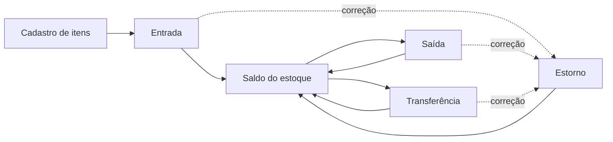
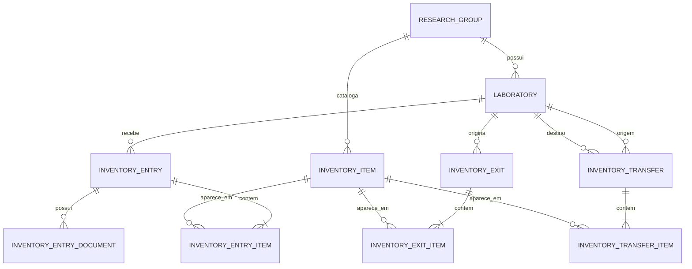
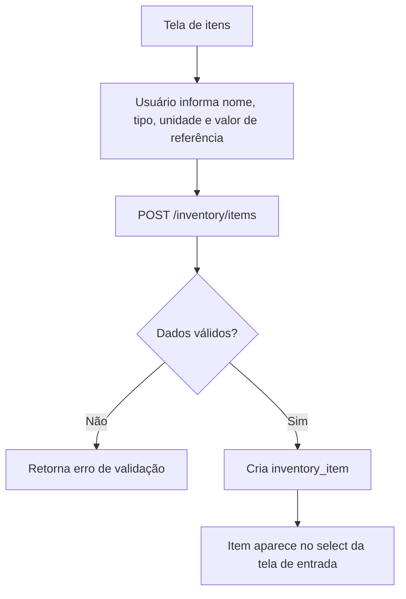
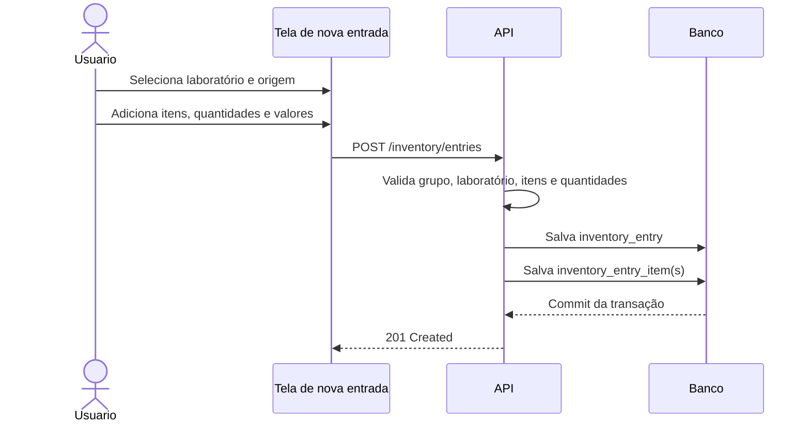
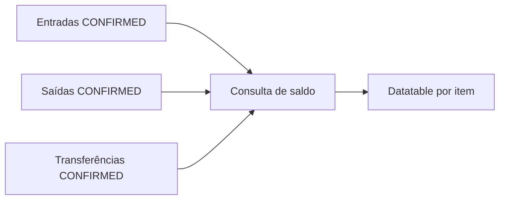
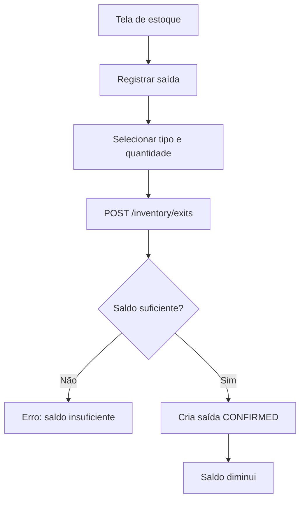
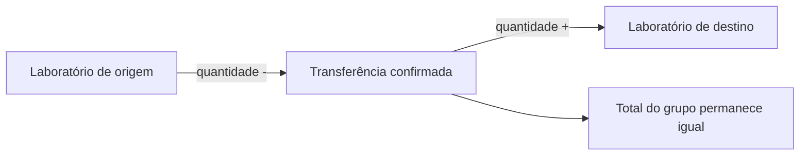
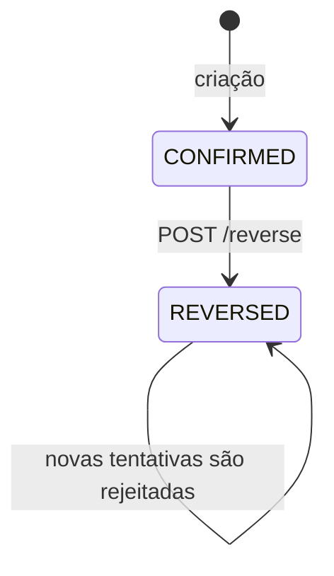
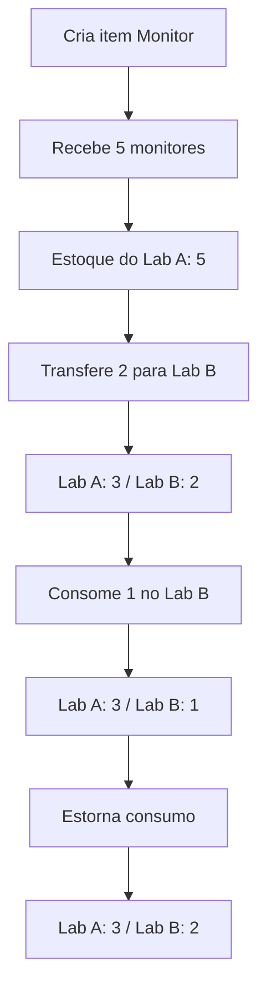

# Estoque: fluxo completo

Este documento resume, de forma visual, como o estoque funciona no myLab: cadastro de itens, entradas, consulta de saldo, saídas, transferências e estornos.

## 1. Ideia principal

O estoque não é editado diretamente. O saldo é sempre calculado a partir das movimentações confirmadas.



Em outras palavras:

```text
Item do catálogo
       |
       v
Entrada confirmada -----> aumenta o saldo
       |
       v
Estoque atual -----------> consulta consolidada
       |
       +---- Saída ------> diminui o saldo
       |
       +---- Transferência -> move o saldo entre laboratórios
       |
       +---- Estorno ----> desfaz o efeito sem apagar o histórico
```

## 2. O que cada tabela representa



### Catálogo

`inventory_item` representa o tipo de item que pode existir no estoque, por exemplo:

```text
Monitor LG Ultragear
Mouse sem fio Logitech
Teclado USB
```

Ele guarda dados relativamente permanentes:

- nome e descrição;
- tipo (`PERMANENT` ou `CONSUMABLE`);
- unidade (`UN`, `CX`, `KIT`, `KG`, etc.);
- valor unitário de referência;
- grupo de pesquisa;
- situação ativa/arquivada.

O cadastro não representa a quantidade atual. A quantidade vem das movimentações.

### Movimentações e linhas

Cada movimentação possui um cabeçalho e uma ou mais linhas:

```text
inventory_entry       = cabeçalho de uma entrada
inventory_entry_item  = item e quantidade recebidos

inventory_exit        = cabeçalho de uma saída
inventory_exit_item   = item e quantidade retirados

inventory_transfer        = cabeçalho da transferência
inventory_transfer_item   = item e quantidade transferidos
```

Exemplo: entrada de 5 mouses e 10 monitores:

```text
inventory_entry:       1 linha
inventory_entry_item:  2 linhas
  - mouse, quantidade 5
  - monitor, quantidade 10
```

Não é criada uma linha para cada unidade física.

## 3. Fluxo 1: cadastro do item

Antes de registrar uma entrada, o item precisa existir no catálogo.



Endpoints do catálogo:

```http
GET    /api/v1/research-groups/{groupId}/inventory/items
POST   /api/v1/research-groups/{groupId}/inventory/items
GET    /api/v1/inventory/items/{itemId}
PUT    /api/v1/inventory/items/{itemId}
DELETE /api/v1/inventory/items/{itemId}
```

Quando o item já possui movimentações, a exclusão deve ser tratada como arquivamento para preservar o histórico.

## 4. Fluxo 2: entrada no estoque

Uma entrada registra a origem dos materiais e adiciona quantidade ao laboratório escolhido.



Body resumido:

```json
{
  "laboratoryId": "UUID_DO_LABORATORIO",
  "source": "PURCHASE",
  "purchaseType": "FUNDING",
  "sourceName": "Fornecedor Exemplo",
  "receivedAt": "2026-09-22",
  "notes": "Entrada de equipamentos",
  "items": [
    {
      "inventoryItemId": "UUID_DO_MONITOR",
      "quantity": 10,
      "historicalUnitValue": 1199.99
    },
    {
      "inventoryItemId": "UUID_DO_MOUSE",
      "quantity": 5,
      "historicalUnitValue": 89.99
    }
  ]
}
```

Endpoint:

```http
POST /api/v1/research-groups/{groupId}/inventory/entries
```

Uma entrada pode ter documentos fiscais associados futuramente. A entrada pode existir sem documento, como no caso de uma doação.

## 5. Fluxo 3: consulta do saldo

A tela de estoque é uma visão consolidada e não deve permitir edição direta da quantidade.



Saldo por laboratório:

```text
saldo = entradas
      + transferências recebidas
      - saídas
      - transferências enviadas
```

Saldo consolidado do grupo:

```text
saldo do grupo = entradas - saídas
```

As transferências internas não alteram o total do grupo; apenas mudam o laboratório onde o item está disponível.

Endpoint:

```http
GET /api/v1/research-groups/{groupId}/inventory/stock
GET /api/v1/research-groups/{groupId}/inventory/stock?laboratoryId={laboratoryId}
```

Exemplo visual da tela:

```text
Laboratório: [Todos                         v]  Buscar: [____________]

| Item                    | Unidade | Quantidade | Valor total |
|-------------------------|---------|-----------:|------------:|
| Mouse sem fio Logitech  | UN      |         10 | R$   899,90 |
| Monitor LG Ultragear    | UN      |          5 | R$ 5.999,95 |
|                         TOTAL      |          15 | R$ 6.899,85 |

Ações: Ver detalhes | Registrar saída | Transferir
```

## 6. Fluxo 4: saída de estoque

Uma saída representa consumo, descarte ou perda definitiva no laboratório.



Tipos atuais:

```text
CONSUMPTION = consumo ou uso
DISPOSAL     = descarte
LOSS         = perda ou extravio
```

Endpoint:

```http
POST /api/v1/research-groups/{groupId}/inventory/exits
```

Body:

```json
{
  "laboratoryId": "UUID_DO_LABORATORIO",
  "type": "CONSUMPTION",
  "occurredAt": "2026-09-22",
  "notes": "Materiais utilizados no experimento",
  "items": [
    {
      "inventoryItemId": "UUID_DO_MOUSE",
      "quantity": 3
    }
  ]
}
```

O custo unitário da saída é calculado pelo backend e salvo na linha da saída. O frontend não envia esse valor.

## 7. Fluxo 5: transferência entre laboratórios

Transferência não é uma perda para o grupo. Ela move o saldo entre dois laboratórios.



Exemplo:

```text
Antes:
  Laboratório A: 10 monitores
  Laboratório B:  2 monitores

Transferência: 3 monitores de A para B

Depois:
  Laboratório A:  7 monitores
  Laboratório B:  5 monitores
  Grupo:         12 monitores
```

Endpoint:

```http
POST /api/v1/research-groups/{groupId}/inventory/transfers
```

Body:

```json
{
  "sourceLaboratoryId": "UUID_DO_LAB_A",
  "destinationLaboratoryId": "UUID_DO_LAB_B",
  "transferredAt": "2026-09-22",
  "notes": "Transferência para outro laboratório",
  "items": [
    {
      "inventoryItemId": "UUID_DO_MONITOR",
      "quantity": 3
    }
  ]
}
```

O laboratório de origem precisa possuir saldo suficiente. Origem e destino devem pertencer ao mesmo grupo e ser diferentes.

## 8. Estorno: corrigir sem apagar

Estorno é a forma de corrigir uma movimentação já confirmada.



O estorno atualiza a própria linha do cabeçalho:

```text
status          CONFIRMED -> REVERSED
reversed_at     NULL       -> data/hora do estorno
reversal_reason NULL       -> motivo informado
```

Não existe exclusão física e não é utilizado `deleted_at` para movimentações.

Endpoints:

```http
POST /api/v1/inventory/entries/{entryId}/reverse
POST /api/v1/inventory/exits/{exitId}/reverse
POST /api/v1/inventory/transfers/{transferId}/reverse
```

Body dos três endpoints:

```json
{
  "reason": "Movimentação registrada por engano"
}
```

Depois do estorno:

- entrada deixa de somar ao saldo;
- saída deixa de subtrair do saldo;
- transferência deixa de retirar da origem e adicionar ao destino;
- histórico e detalhes continuam disponíveis.

## 9. Histórico e detalhes

As consultas de histórico exibem movimentações confirmadas e estornadas. Isso permite auditoria.

### Entradas

```http
GET /api/v1/research-groups/{groupId}/inventory/entries
GET /api/v1/inventory/entries/{entryId}
```

Filtros do histórico: `laboratoryId`, `source`, `inventoryItemId`, `dateFrom` e `dateTo`.

### Saídas

```http
GET /api/v1/research-groups/{groupId}/inventory/exits
GET /api/v1/inventory/exits/{exitId}
```

Filtros do histórico: `laboratoryId`, `type`, `inventoryItemId`, `dateFrom` e `dateTo`.

### Transferências

```http
GET /api/v1/research-groups/{groupId}/inventory/transfers
GET /api/v1/inventory/transfers/{transferId}
```

Filtros do histórico: `sourceLaboratoryId`, `destinationLaboratoryId`, `inventoryItemId`, `dateFrom` e `dateTo`.

## 10. Telas planejadas no frontend

```text
1. Tela de itens
   - listar itens do catálogo
   - criar, editar e arquivar item

2. Tela de nova entrada
   - selecionar laboratório
   - informar origem
   - adicionar várias linhas de itens
   - anexar documento quando essa etapa for implementada

3. Tela de estoque
   - saldo agrupado por item
   - filtro por laboratório
   - valor total por item
   - total geral do estoque
   - Ver detalhes, Registrar saída e Transferir

4. Tela de nova saída
   - selecionar laboratório
   - selecionar tipo
   - adicionar itens e quantidades
   - confirmar saída

5. Tela de nova transferência
   - selecionar origem e destino
   - adicionar itens e quantidades
   - confirmar transferência

6. Tela de histórico
   - abas de entradas, saídas e transferências
   - filtros por laboratório, item, tipo/origem e período
   - abrir detalhes
   - estornar movimentação
```

## 11. Exemplo completo do ciclo



O fluxo sempre preserva as movimentações. O saldo exibido é apenas uma projeção calculada a partir do histórico confirmado.

## 12. Fora do escopo atual

- empréstimos e devoluções;
- reservas de materiais;
- aprovação de movimentações;
- identificação individual por número de série ou patrimônio;
- seleção manual de lotes na saída;
- associação da movimentação a usuário ou projeto;
- upload de documentos no MinIO.

Documentos fiscais e MinIO continuam previstos como uma evolução: o banco deverá guardar apenas os metadados e a chave do arquivo armazenado.
